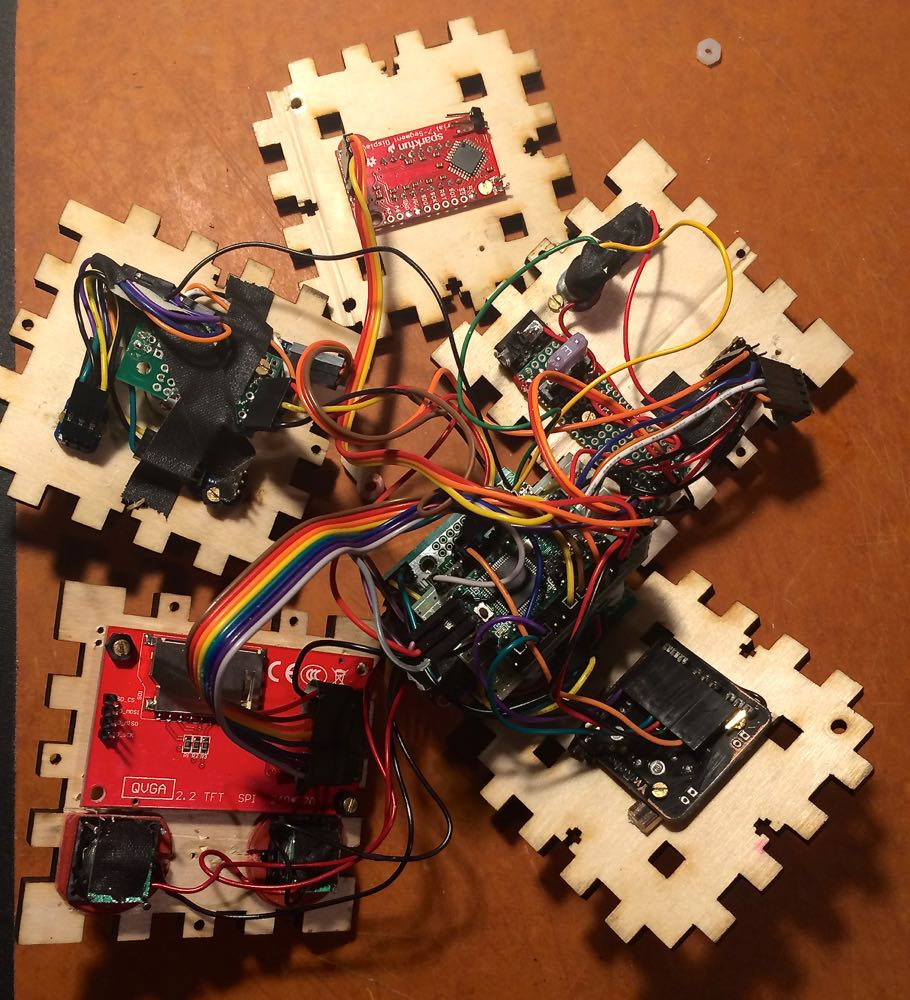

## FilxCapacitor

A little flux/filx capacitor box based on Teensy 3.1 for showing pictures, clock, playing DJ sets, and starting a small rave in a recovery room.  It was made as a recovery gift for Fil, one of my closest friends, after a horrific car accident.

## Functionality

It's a clock (on the left side) using Adafruit 7 Segment display, with a separate switch on the back that turns on Amp + LED display. 

Joystick on the right has a button in addition to X/Y. 

Clicking the button cycles through modes: 
* Clock
* Turn on Light Show
* Turn on Photo Show
* Set Time
* Shutoff all "shows"

Pulling Joystick UP starts the music (there are several DJ sets on the SD card). 
Pulling joystick down stops music. 
Pulling Joystick forward/back advances photos forward or backwards. 

Volume control is on the top, controlling the two tiny 2W speakers are on the front.

Photoshow cycles through about 200 pictures stored on the 32GB SD card, together with several Gb of music, with 6 second interval.  Manual intervention (forward/back) pauses autoplay for 18 seconds.

### Hardware

* 1 x Teensy 3.1
* 1 x Audio Shield
* 1 x 320x240 TFT Display
* 4 x NeoPixels (breadboard)
* 1 x joystick
* 1 x small Adafruit Class D amplifier
* 1 x switch on the back (for turning off Amp and TFT Display's LED)
* 1 x potentiometer for adjusting display brightness
* 1 x 2A fuse

### Depedencies

* Adafruit_GFX
* Adafruit-LED-Backpack-Library
* Adafruit_NeoPixel
* Audio
* Time
* DS1307RTC
* ILI9341_t3
* SPI
* SD
* Wire

### Making 

This was a challenging project for many reasons, but one in particular was the small size. I wanted to use crimps and joins instead of soldering wire everywhere, so that I could replace components. This worked really well as I had to replace several of them. But small size made it very difficult to position everything inside and fit without pressure and/or moving/damaging other parts.

## Contributing

1. Fork it
2. Create your feature branch (`git checkout -b my-new-feature`)
3. Commit your changes (`git commit -am 'Added some feature'`)
4. Push to the branch (`git push origin my-new-feature`)
5. Create new Pull Request

## Author

Konstantin Gredeskoul, @kig on twitter, http://github.com/kigster

## License

MIT License.  See LICENSE file for more details.

